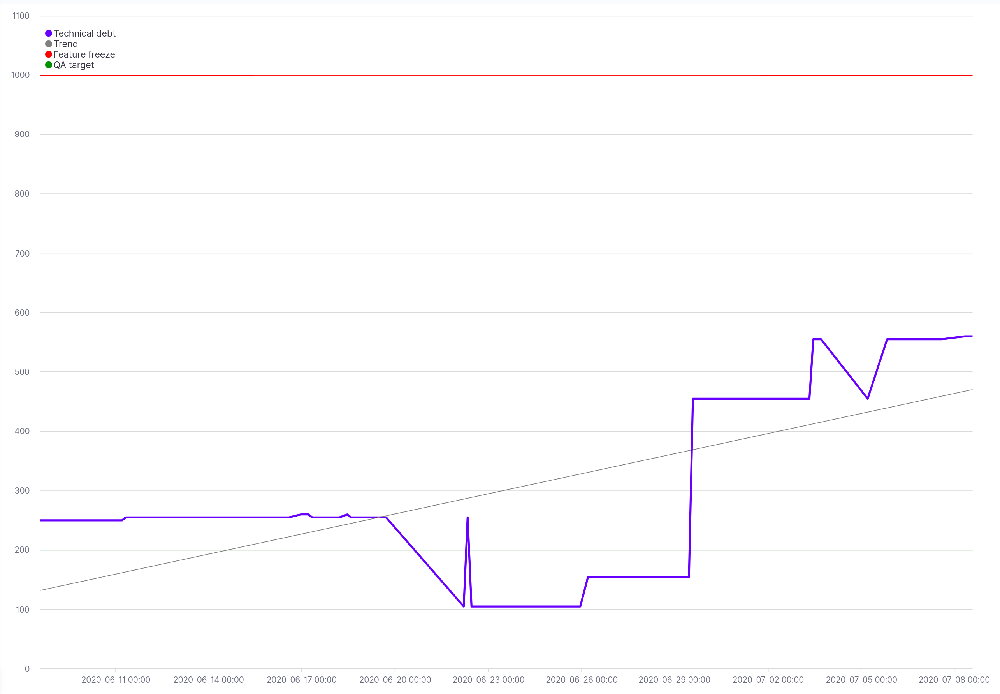

# Technical debt tracker

> As with monetary debt, if technical debt is not repaid, it can accumulate 'interest', making it harder to implement changes.

## 🐿️ In a nutshell
Use PHP annotations _(docblocks annotations)_ to monitor your technical debt.
```php
/**
  * @TechnicalDebt(
  *     categories={"tightly coupled", "lack of test"}, 
  *     reporter="Flavien Rodrigues", 
  *     description="Lorem ipsum sit dolor amet"
  * )
  */
class DummyService
{
    // ...
}
```
Then run our script as CI step and record the result into your monitoring tool.
```
vendor/bin/technical-debt-tracker
```

## 💯 Ranked categories
By default, we provide these common categories

| Category                       | Score   | Description                                  |
| :----------------------------- | :------ | :------------------------------------------- |
| security issue                 | 500     |                                              |
| hard to understand             | 200     |                                              |
| tightly coupled                | 150     | Where functions are not modular, the software is not flexible enough to adapt to changes in business needs. |
| need tests                     | 150     |                                              |
| delayed refactoring            | 100     | As the requirements for a project evolve, it may become clear that parts of the code have become inefficient or difficult to edit and must be refactored in order to support future requirements. The longer refactoring is delayed, and the more code is added, the bigger the debt. |
| core feature                   | 50      | Add penalty on applications's critical parts |
| need documentation             | 10      | Where code is created without supporting documentation. The work to create documentation represents debt |
| bad practice                   | 5       | Where industry standard features, frameworks, technologies are ignored. Eventually integration with standards will come, and doing so sooner will cost less |
| wip                            | 5       | Work in progress                             |

## 📉 Technical debt monitoring

<p align="center">
    
</p>
